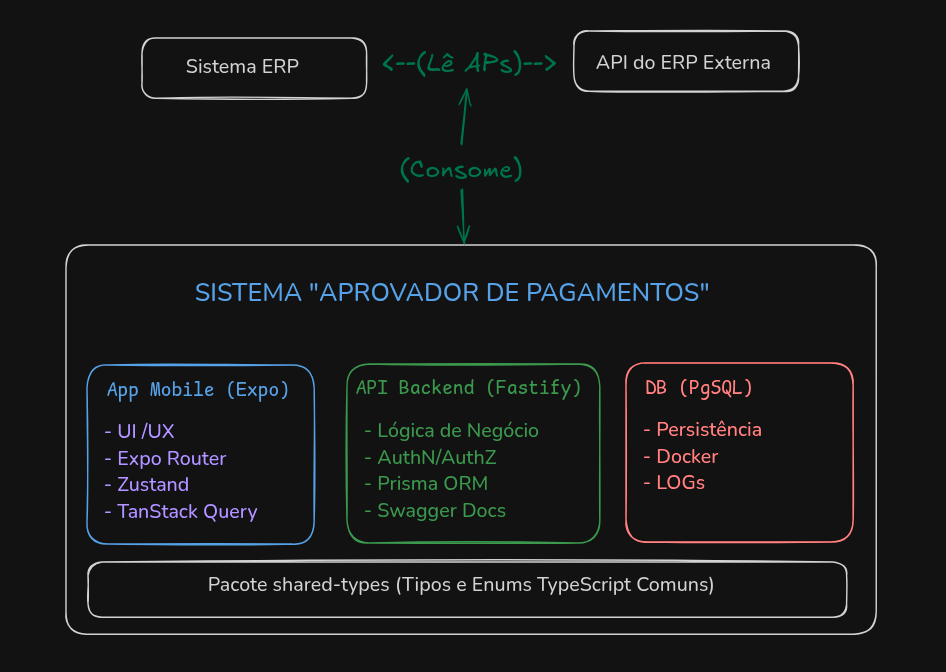

# 3. Arquitetura da Solução

Este documento descreve a arquitetura de alto nível do sistema "Aprovador de Pagamentos Digital", as tecnologias empregadas e as principais decisões de design.

## 3.1. Visão Geral da Arquitetura

O sistema é construído utilizando uma arquitetura Monorepo, gerenciada com PNPM Workspaces. Ele é composto pelas seguintes partes principais:

- **Backend (API):** Um servidor Node.js construído com o framework Fastify, responsável por toda a lógica de negócio, autenticação, autorização, gerenciamento do fluxo de aprovação, interação com o banco de dados e comunicação com a API externa do ERP.
- **Frontend (Aplicativo Mobile):** Um aplicativo mobile multiplataforma desenvolvido com React Native e Expo, que consome a API do backend para fornecer a interface do usuário para solicitantes, aprovadores e o departamento financeiro.
- **Banco de Dados:** Um banco de dados PostgreSQL para persistir os dados gerenciados pelo nosso sistema (usuários, estado das APs no nosso fluxo, comentários, anexos do app, logs de auditoria).
- **Tipos Compartilhados:** Um pacote dedicado (`shared-types`) dentro do monorepo para definir interfaces e Enums TypeScript comuns, garantindo consistência entre o backend e o frontend.
- **Integração com ERP:** O sistema se integra com uma API externa do ERP (a ser definida) para ler dados iniciais das Requisições de Pagamento (APs). A interação é primariamente de leitura do ERP.

## 3.2. Diagrama de Arquitetura de Alto Nível

_Diagrama simples de exemplo de arquitetura:_

**Exemplo de Representação Textual:**

## 3.3. Tecnologias (Stack Tecnológico)

- **Monorepo:**
  - PNPM Workspaces
- **Backend (`packages/api`):**
  - **Runtime:** Node.js (v18+)
  - **Framework Web:** Fastify
  - **Linguagem:** TypeScript
  - **ORM:** Prisma
  - **Banco de Dados:** PostgreSQL
  - **Autenticação:** JWT (JSON Web Tokens)
  - **Documentação API:** Swagger/OpenAPI (via `@fastify/swagger`)
  - **Validação:** Typebox (para schemas Fastify)
- **Frontend (`packages/mobile`):**
  - **Framework:** React Native (gerenciado com Expo)
  - **Linguagem:** TypeScript
  - **Navegação:** Expo Router
  - **Gerenciamento de Estado:** Zustand
  - **Componentes de UI:** React Native Tab View, Componentes customizados
  - **Comunicação API:** Axios (para chamadas HTTP)
  - **Armazenamento Seguro:** Expo Secure Store (para token JWT)
  - **Ícones:** `@expo/vector-icons`
  - **Efeitos Visuais:** `react-native-skeleton-placeholder`, `react-native-linear-gradient`
- **Tipos Compartilhados (`packages/shared-types`):**
  - TypeScript
- **Banco de Dados (Desenvolvimento):**
  - PostgreSQL rodando em Docker

## 3.4. Estrutura de Pastas Principais

_(Descrever brevemente a estrutura de `packages/api/src` e `packages/mobile/app`, `components`, `store`, `constants`, `styles`, e o propósito de `packages/shared-types`)_

- **`packages/api/src/`**:
  - `config/`: Configurações, como schemas de variáveis de ambiente.
  - `lib/`: Utilitários de baixo nível (ex: hash de senha, instância do Prisma).
  - `plugins/`: Plugins Fastify para funcionalidades transversais (CORS, JWT, Auth, Swagger).
  - `routes/`: Definição dos endpoints da API, agrupados por recurso.
  - `services/`: Lógica de negócio e interação com o banco/outras APIs (a ser expandido).
  - `server.ts`: Ponto de entrada, configuração e inicialização do servidor Fastify.
- **`packages/mobile/`**:
  - `app/`: Estrutura de rotas (Expo Router).
  - `assets/`: Fontes, imagens.
  - `components/`: Componentes React Native reutilizáveis.
  - `constants/`: Constantes (ex: Cores, Layout).
  - `context/`: Contextos React (ex: AuthContext, se criado).
  - `data/`: Dados mock (usados no desenvolvimento inicial).
  - `services/`: Funções para interagir com a API backend.
  * `store/`: Lógica de gerenciamento de estado global (Zustand).
  * `styles/`: Arquivos de estilos reutilizáveis ou específicos de telas/componentes.
  * `theme/`: Definições de tema (ex: AppDarkTheme).
- **`packages/shared-types/src/`**:
  - `enums/`: Definições de Enums compartilhados.
  - `types/`: Definições de Interfaces TypeScript compartilhadas.
  - `index.ts`: Ponto de entrada que exporta todos os tipos e enums.

## 3.5. Fluxo de Dados Principal (Alto Nível)

1.  Uma Requisição de Pagamento (AP) é criada no sistema **ERP**.
2.  A **API do ERP** disponibiliza essa AP (via Webhook ou para Polling).
3.  Nossa **API Backend** consome os dados da AP do ERP e cria/atualiza um registro correspondente em nosso **Banco de Dados PostgreSQL**, marcando-a com um status inicial (ex: "Aguardando Configuração de Fluxo").
4.  O **Aplicativo Mobile** busca essas APs da nossa API Backend e as exibe para o **Solicitante**.
5.  O Solicitante, no App Mobile, define a **sequência de aprovadores** para a AP. Essa informação é enviada para nossa API Backend e salva no nosso Banco de Dados. O status da AP muda.
6.  A AP segue a sequência:
    - O App Mobile mostra a AP para o **aprovador da vez**.
    - O Aprovador usa o App Mobile para aprovar ou rejeitar (com motivo).
    - A ação é enviada para nossa API Backend, que atualiza o status no nosso Banco de Dados e registra o comentário/motivo.
    - Se rejeitada, a AP volta para o Solicitante no App Mobile.
    - Se aprovada, avança para o próximo aprovador ou para o Financeiro.
7.  O **Departamento Financeiro**, usando o App Mobile, visualiza APs totalmente aprovadas, registra o pagamento no nosso sistema e anexa o comprovante. Nossa API Backend salva essas informações.
8.  _(Opcional: Nossa API Backend poderia ter um mecanismo para tentar refletir um status final no ERP, mas atualmente o escopo é read-only do ERP)._

## 3.6. Decisões Arquiteturais Chave (Rationale)

- **Monorepo (PNPM Workspaces):** Facilita o compartilhamento de código (especialmente `shared-types`), a consistência de dependências e a execução de scripts em um ambiente unificado.
- **Fastify (Backend):** Escolhido por sua alta performance, baixo overhead, extensibilidade via plugins e bom suporte a TypeScript e schemas de validação (Typebox).
- **Prisma ORM (Backend):** Oferece excelente segurança de tipos, migrações fáceis de gerenciar e uma API de query intuitiva para interagir com o PostgreSQL.
- **Expo (Frontend Mobile):** Simplifica o desenvolvimento React Native, oferece um ótimo fluxo de trabalho, acesso a uma vasta gama de APIs nativas e facilita o processo de build e publicação.
- **Expo Router (Frontend Mobile):** Fornece um sistema de navegação moderno e robusto baseado em arquivos, com bom suporte a layouts e navegação tipada.
- **Zustand (Frontend Mobile):** Escolhido para gerenciamento de estado global por sua simplicidade, flexibilidade e baixo boilerplate.
- **TypeScript (Em todo o projeto):** Garante segurança de tipos, melhora a manutenibilidade e a experiência de desenvolvimento em projetos maiores.
- **Abordagem "API-First" (implícita):** Definir e construir uma API backend robusta primeiro, que depois é consumida pelo frontend.
- **Componentização (Frontend):** Foco em criar componentes reutilizáveis e manter os componentes de tela enxutos.
